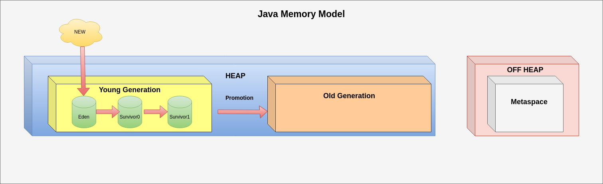

The Garbage Collector is a JVM process specialized for allocating and releasing memory. It works in the background and is completely invisible to the programmer.
The Garbage Collector analyzes the links between objects, finds those that are not necessary, and then removes them.

The Garbage Collector cannot afford to clean the entire available memory area. Such an operation would be long-term and would have a negative impact on the performance of the entire application. 

Thats why memory is divided into regions - called generations (young and old). The young generation is divided into several internal areas, called eden, survivor0, survivor1. In each of these areas, objects of a certain maturity are stored.New objects are created in the eden space, while the oldest objects ultimately end up in the old space. 

Each generation can be clean in separate cycles - we call them collections. During these cycles, the Garbage Collector moves the used objects to areas with higher stability.

 

  **Tip:** These divisions result from the concept on which the Garbage Collector is based - the generation hypothesis. It assumes that the latest created objects become unnecessary the fastest. Objects that survive several cleaning cycles become stable and are less likely to be removed.

In the case of G1 GC, we can distinguish between four main types collection cycles:

  <table style="align:left;border:1px solid gray; text-align:left; margin-right:auto;margin-left:0px">
    <tr>
        <td width="50%">young collection cycle</td>
        <td>During this collection, GC pauses the application threads to move live objects from the young regions into survivor regions or promote them into old regions</td>
    </tr>       
       <tr>
        <td width="50%">mixed collection cycle</td>
        <td>During this collection  the steps of the young collection are carried out and, in addition G1 GC additionaly moves live objects from some old regions to free ones, which become a part of the old generation. Single mixed collection is similar to a young collection pause. Sometimes, there could be more tha one mixed collection pause. This is called a mixed collection cycle.</td>
    </tr>
     <tr>
        <td width="50%">multistage concurrent marking cycle</td>
        <td>This collection is run, when the old generation occupancy reaches the threshold. During this stage G1 GC calculates the amount of live objects per old region, and ranks the old regions.</td>
     </tr>
    <tr>
        <td width="50%">full garbage collection pause</td>
        <td>  </td>
    </tr>
</table>

  **Tip:** You can find a detailed description of how the GC works in the book [Java® Performance Companion](https://www.oreilly.com/library/view/java-performance-companion/9780133796896)

Some collections (or collection stages) have a particularly large impact on the application's performance because they require threads to stop - we call them GC pauses (or stop-the-world-phase). During these pauses, our application is stopped and does not perform its tasks!

For a well-functioning Garbage Collector, pauses should be as short as possible, and as much memory as possible should be freed up as a result.

Unfortunately, the Garbage Collector does not always work well. 

Sometimes you may find that application pauses happen too often, or last too long. As a result, our application slows down and performance problems that are difficult to diagnose occur.

In another scenario, the malfunctioning of the Garbage Collector leads to memory leaks. These occur when memory release is inefficient. The Garbage Collector (due to various possible reasons) cannot delete objects that should be discarded. This results in the gradual consumption of all available memory.

In both cases, the consequences can be very serious. As programmers, we need to be prepared for them and know how to deal with them.

A powerful tool we have in our toolbox is the Garbage Collector log. This is a text file that is a log of the operations it performs. 