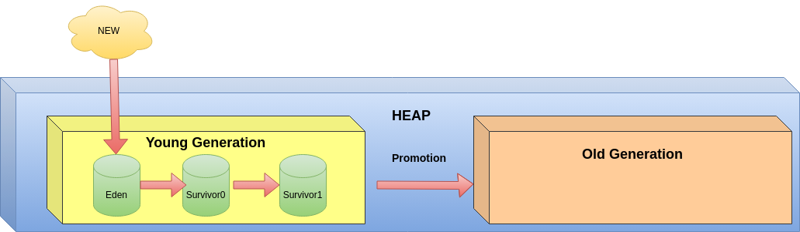

## Wstęp

Garbage Collector to cichy bohater każdej aplikacji java. Zamknięty wewnątrz czarnego pudła z etykieta "jvm" wykonuje ciężką pracę, której nikt inny wykonywać nie chce.  Chwalimy go rzadko, bo  gdy radzi sobie świetnie, jest niewidoczny. Narzekamy, gdy jego nieprawidłowa praca skutkuje nadmiernym zużywaniem pamięci lub niespodziewanymi pauzami aplikacji. Poszukiwanie przyczyn to proces trudny i czasochłonny. Wymaga wiedzy na temat działania wirtualnej maszyny, modelu pamięciowego oraz specyfiki działania samego Garbage Collectora. Na szczęście nie pozostajemy z tym sami, dysponujemy narzędziami, które mogą nam w tym pomóc. W dzisiejszym artykule opiszę w jaki sposób sami możemy stworzyć takie narzędzie.

Zanim zaczniemy jednak pisać kod, przypomnijmy sobie kilka najważniejszych informacji o naszym bohaterze.

Garbage Collector to proces JVM specjalizujący się w przydzielaniu i zwalnianiu pamięci. 

Bazuje on na koncepcji zwanej Hipotezą Generacyjną. Zakłada ona, że najszybciej giną obiekty najmłodsze. Im obiekt jest starszy, tym szanse na jego przetrwanie są większa.  
Zgodnie z tym założeniem,  pamięć została podzielona na regiony- nazywane generacjami (młodą i starą). Młoda generacja jest podzielona na kilka wewnętrznych obszarów, nazywanych Eden, Survivor 0, Survivor 1. W każdym z tych obszarów przechowywane są obiekty o określonej dojrzałości. 
Nowe obiekty są tworzone w przestrzeni Eden. Następnie Garbage Collector przenosi obiekty używane do obszarów o większej stabilności. W ten sposób obiekty "wędrują" najpierw we wnętrzu generacji nowej, a następnie, te które żyją najdłużej nagradzane są promocją są do generacji starej. Obiekty nieużywane są usuwane.

 

Taka organizacja procesu zarządzania pamięcią pozwala na jego optymalizację. Każdą generację można sprzątać w oddzielnych, cyklach- które nazywają się kolekcjami. Ponieważ ich działanie ogranicza się do określonego obszaru, mogą podlegać dużej specjalizacji. Dzięki temu zużywają mniej zasobów i mają mniejszy wpływ na aplikację.  

Niektóre kolekcje  mają szczególnie duży wpływ na wydajność aplikacji, ponieważ wymagają zatrzymania wątków- nazywamy to pauzami GC (lub fazą stop-the-world). Podczas tych pauz nasza aplikacja jest zatrzymywana i nie może wykonywać swoich zadań biznesowych. 

In the case of G1 GC, we can distinguish between four main types collection cycles:

  <table style="align:left;border:1px solid gray; text-align:left; margin-right:auto;margin-left:0px">
    <tr>
        <td width="50%">young collection cycle</td>
        <td>During this collection, GC pauses the application threads to move live objects from the young regions into survivor regions or promote them into old regions</td>
    </tr>       
       <tr>
        <td width="50%">mixed collection cycle</td>
        <td>During this collection  the steps of the young collection are carried out and, in addition G1 GC additionaly moves live objects from some old regions to free ones, which become a part of the old generation. Single mixed collection is similar to a young collection pause. Sometimes, there could be more tha one mixed collection pause. This is called a mixed collection cycle.</td>
    </tr>
     <tr>
        <td width="50%">multistage concurrent marking cycle</td>
        <td>This collection is run, when the old generation occupancy reaches the threshold. During this stage G1 GC calculates the amount of live objects per old region, and ranks the old regions.</td>
     </tr>
    <tr>
        <td width="50%">full garbage collection pause</td>
        <td>  </td>
    </tr>
</table>

**Tip:** You can find a detailed description of how the GC works in the book [Java® Performance Companion](https://www.oreilly.com/library/view/java-performance-companion/9780133796896)

Niestety źle działający GC może być powodem wielu problemów.

Czasami można zauważyć, że pauzy aplikacji występują zbyt często lub trwają zbyt długo. W rezultacie nasza aplikacja dramatycznie zwalnia i pojawiają się dziwne trudne do diagnozowania problemy wydajnościowe. 

Drugim często spotykanym problemem jest wyciek pamięci. Występuje on, gdy zwalnianie pamięci jest niewydajne. Garbage Collector (z różnych możliwych powodów) nie może usunąć obiektów, które powinny zostać wyrzucone. Zużywana zostaje cała dostępna pamięć.

I teraz zbliżamy się do sedna problemu, jak określić czy nasz GC działa w sposób prawidłowy. 

Potężnym narzędziem, które mamy w swoim arsenale, jest dziennik GC. Jest to plik tekstowy zawierający zapis operacji, które wykonuje.

  

